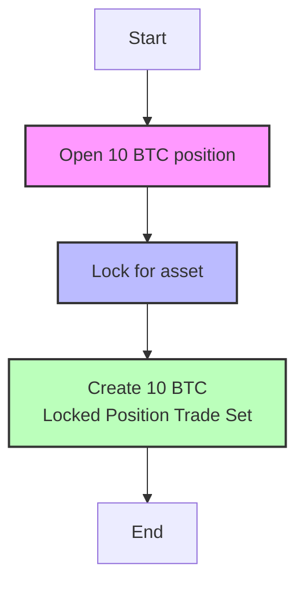
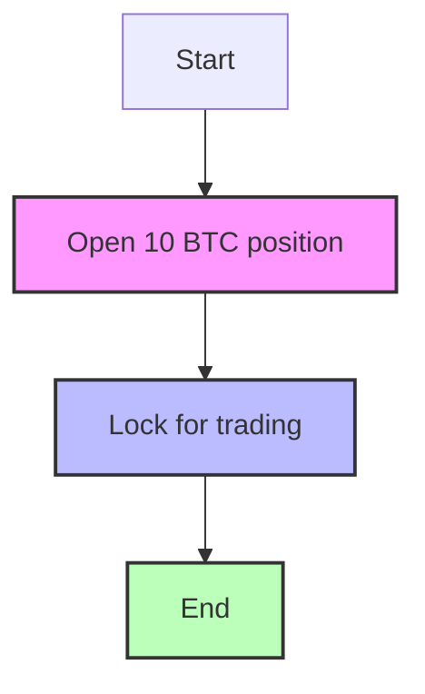
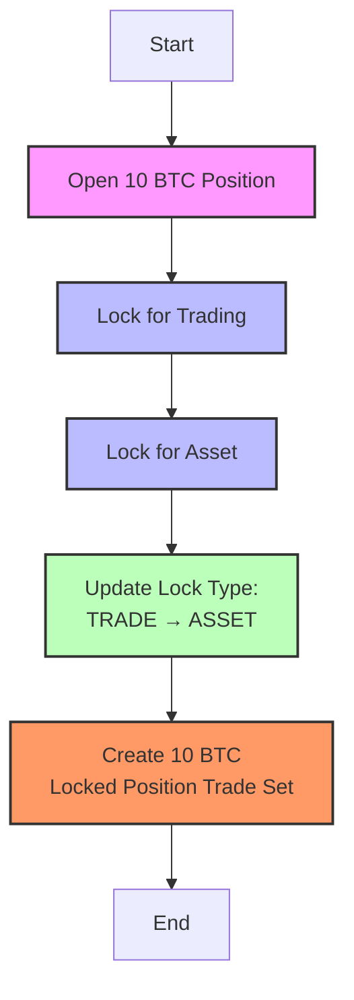
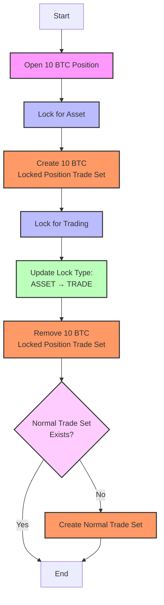
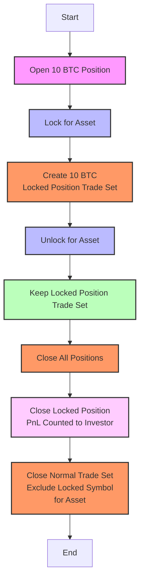

# RFC: [Descriptive Title]

**Authors:** Minh Tran
**Project:** Trading Platform and Funds Management
**Status:** WIP
**Created:** [18/12/2024]
**RFC PR:** [Link to the Pull Request discussing this RFC, once created]

## Summary

Implement how we calculate PnL and prevent user action touch to accounts have locked position include locked for assets and locked for trading

## Motivation

- **What problem does this proposal solve?**
  To help user can trade on locked symbol while locked position is opening

- **Who is affected by this proposal, and how?**
  - **End-users:** Can define action type to let system calculate PnL base on action
  - **Investor:** Can earn more profit from trade and their locked for asset position still safe

## Proposal

### Technical Details
- Add type into API `locked-position`

- Update account trade set worker flow to create locked position trade set if user lock for asset only

- Update script to retrieve trade set base on locked for asset only

### Some scenario examples

#### Locked scenario

1. Open then lock for asset

2. Open then lock for trading

3. Open then change lock type from trade to asset

4. Open then change lock type from asset to trade

#### Unlocked scenario

##### 1. Unlocked for trading
- User can add or close on this symbol normally with normal trade set

##### 2. Unlocked for asset

#### Dependencies and Integration
NONE

## Drawbacks

Need to update retrieve base on lock type

## Alternatives

## Adoption and Migration Strategy

### Implementation Plan

1. Migrate DB for locked_positions and locked_position_histories
2. Update API endpoint
3. Update FE to help user can interaction
4. Update account trade set worker can define when close normal trade set and how to calculate pnl
5. Update retrieve trade set script

### Migration

- Schema **locked_positions**
  - add `type` varchar (ASSET | TRADING)
  - add `qty` decimal(20,8)

- Schema **locked_position_histories**
  - add `type` varchar (ASSET | TRADING)
  - add `qty` decimal(20,8)
  - `action` has more `MODIFY` value

### Documentation and Education
N/A

## Definition of Success

- User can know which lock type of locked position and can lock, unlock, and change type
- System can calculate correct PnL separately between trading and holding asset

## Unresolved Questions

In FE which solution we allow
1. Have to unlock before lock other type
2. User can change type directly while locking position

## Future Possibilities
N/A
